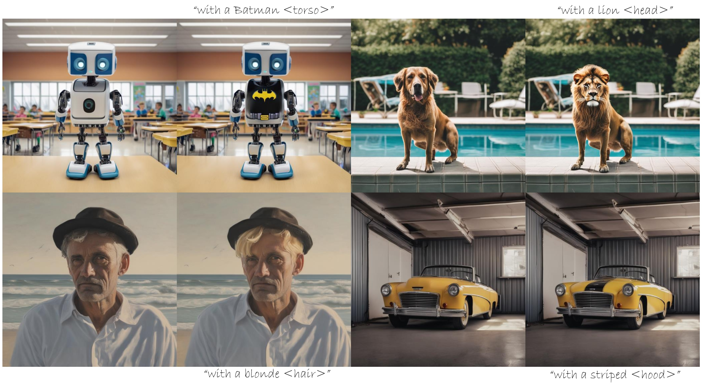

# PartEdit: Fine-Grained Image Editing using Pre-Trained Diffusion Models


<!-- [](google.com) -->
[](https://arxiv.org/abs/2502.04050)
[](https://dl.acm.org/doi/10.1145/3721238.3730747)
[](LICENSE)
[](https://gorluxor.github.io/part-edit/)
[](https://huggingface.co/datasets/Aleksandar/PartEdit-Bench)
[](https://huggingface.co/datasets/Aleksandar/PartEdit-extra)
[](https://huggingface.co/spaces/Aleksandar/PartEdit)


<div align="center" style="font-family: Arial, sans-serif;">
  <p>
    <a href="#news" style="text-decoration: none; font-weight: bold;">🎉 News</a> •
    <a href="#introduction" style="text-decoration: none; font-weight: bold;">📖 Introduction</a> 
     <!--✨ -->
  </p>
  <p>
    <a href="#getting-started" style="text-decoration: none; font-weight: bold;">🚀 Getting Started</a> •
    <a href="#acknowledgements" style="text-decoration: none; font-weight: bold;">💖 Acknowledgements</a> •
    <a href="#citation" style="text-decoration: none; font-weight: bold;">🎈 Citation</a>
  </p>
</div>




# 🎉News
- **[2025-09-02]** PartEdit local gradio demo released and huggingface demo live at [huggingface](https://huggingface.co/spaces/Aleksandar/PartEdit).
- **[2025-09-01]** PartEdit embeddings and custom training data used released on [huggingface](https://huggingface.co/datasets/Aleksandar/PartEdit-extra) .
- **[2025-06-02]** PartEdit updated version now on [Arxiv](https://arxiv.org/abs/2502.04050v2).
- **[2025-04-01]** PartEdit was accepted to [Siggraph 2025 conference track](https://dl.acm.org/doi/10.1145/3721238.3730747).
- **[2025-03-09]** PartEdit benchmark available on [huggingface](https://huggingface.co/datasets/Aleksandar/PartEdit-Bench).
- **[2025-02-06]** PartEdit now available on [Arxiv](https://arxiv.org/abs/2502.04050).

# 📖Introduction

In [this paper](https://arxiv.org/abs/2502.04050), We present the first text-based image editing approach for object parts based on pre-trained diffusion models. Diffusion-based image editing approaches capitalized on the deep understanding of diffusion models of image semantics to perform a variety of edits. However, existing diffusion models lack sufficient understanding of many object parts, hindering fine-grained edits requested by users. To address this, we propose to expand the knowledge of pre-trained diffusion models to allow them to understand various object parts, enabling them to perform fine-grained edits. We achieve this by learning special textual tokens that correspond to different object parts through an efficient token optimization process. These tokens are optimized to produce reliable localization masks at each inference step to localize the editing region. Leveraging these masks, we design feature-blending and adaptive thresholding strategies to execute the edits seamlessly. To evaluate our approach, we establish a benchmark and an evaluation protocol for part editing. Experiments show that our approach outperforms existing editing methods on all metrics and is preferred by users 66-90% of the time in conducted user studies.

<!--  -->
# 🚀Getting Started
## Installation
```bash
# from the folder containing environment.yaml
conda env create -f environment.yaml
# (or, faster) 
mamba env create -f environment.yaml
```
followed by 
```bash
conda activate partedit
```
Note for newer pytorch, they switched for pip only 
## Notebook example

The Jupyter notebook [getting_started.ipynb](getting_started.ipynb) contains a full example of how to use PartEdit with SDXL.

## Gradio demo
To run the demo, simply execute, the downloading of model and embeddings will happen automatically:

```bash
hf login # if you have a token
# get a token from https://huggingface.co/settings/tokens
# older versions use `huggingface-cli login`
```
followed by
```bash
python app.py
```

Then open your browser at `http://localhost:7860` (or the link provided in the terminal).

## Different Stable Diffusion versions

The current code has been tested with diffusers library. But there might be minor differences for some samples between different versions.

## Data

The datasets generated in the experiments can be found at [Pascal Part](https://roozbehm.info/pascal-parts/pascal-parts.html) and [PartImageNet](https://github.com/TACJu/PartImageNet).
We train Human Torso, Human Head and Human Hair from Pascal Part and PartImageNet for the rest that is not [custom](https://huggingface.co/datasets/Aleksandar/PartEdit-extra). 

# 💖Acknowledgements

We want to thank the authors of [Prompt-to-Prompt-with-sdxl](https://github.com/RoyiRa/prompt-to-prompt-with-sdxl) and [DAAM](https://github.com/castorini/daam), StabilityAI ([Stable diffusion XL](https://huggingface.co/stabilityai/stable-diffusion-xl-base-1.0)),  

# 🎈Citation

BibTeX:
```bibtex
@inproceedings{cvejic2025partedit,
  title={PartEdit: Fine-Grained Image Editing using Pre-Trained Diffusion Models},
  author={Cvejic, Aleksandar and Eldesokey, Abdelrahman and Wonka, Peter},
  booktitle={Proceedings of the Special Interest Group on Computer Graphics and Interactive Techniques Conference Conference Papers},
  pages={1--11},
  year={2025}
}
```
APA:
```
Cvejic, A., Eldesokey, A., & Wonka, P. (2025, August). PartEdit: Fine-Grained Image Editing using Pre-Trained Diffusion Models. In Proceedings of the Special Interest Group on Computer Graphics and Interactive Techniques Conference Conference Papers (pp. 1-11).
```
